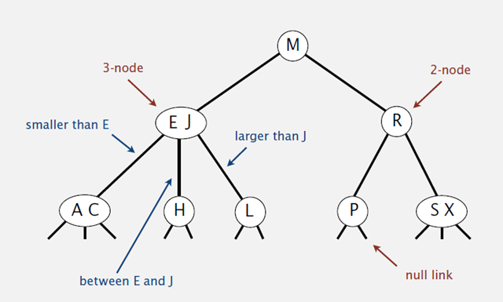
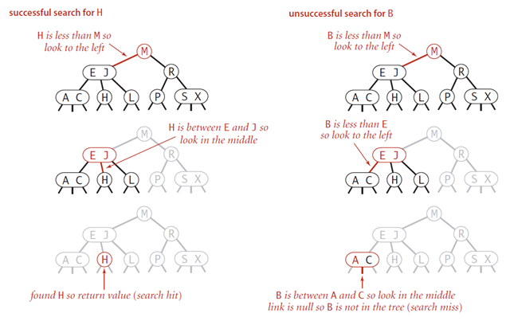
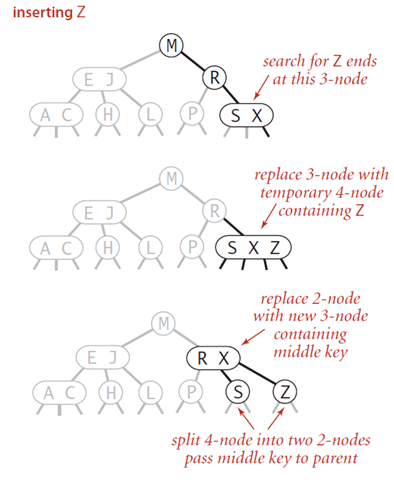
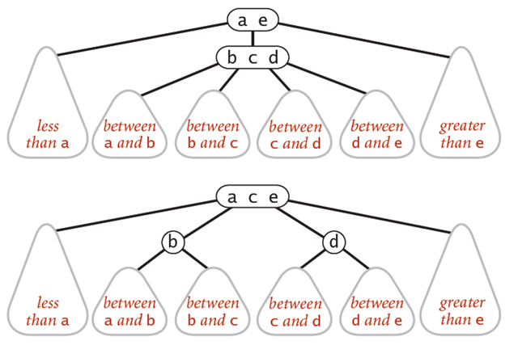
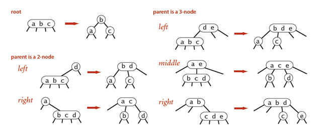
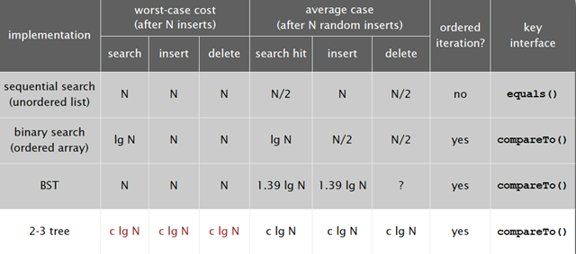

### 平衡查找树之2-3树

#### 定义

和二叉树不一样, 2-3树运行每个节点保存1个或者两个的值。对于普通的2节点(2-node), 他保存1个key和左右两个自己的点。对应3节点, 保存两个key, 2-3查找树的定义如下:

1. 要么为空, 要么:
2. 对于2节点, 该节点保存一个key及对应的value, 以及两个指向左右节点的节点, 左节点也是一个2-3节点, 所有值都比key要小, 右节点也是一个2-3节点, 所有的值比key要大。
3. 对于3节点, 该节点保存两个key以及对应的value, 以及三个指向左中右的节点。左节点也是一个2-3节点, 所有值均比两个key中的最小的key还要小; 中间节点也是一个2-3节点, 中间节点的key值在两个父节点key值之间; 右节点也是一个2-3节点, 节点的所有key值比两个父节点中最大的key还要大。

如果中序遍历2-3查找树, 就可以得到排好序的序列。在一个完全平衡的2-3查找树中, 根节点到每一个为空节点的距离都相同。

#### 查找

在进行2-3树的平衡之前, 我们先假设已经处于平衡状态。

2-3树的查找和二叉查找树类似, 要确定一个值是否属于2-3树, 我们首先和其根节点进行比较, 如果相等, 则查找成功; 否则根据比较的条件, 在其左中右子树中递归查找, 如果找到的节点为空, 则返回。查找过程如下图:

插入

往一个2-node节点插入

在2-3树中插入元素和往二叉查找树中插入元素一样,首先要进行查找,然后将节点挂到未找到的节点上。2-3树之所以能够保证在最差的情况下的效率的原因在于其插入之后仍然能够保持平衡状态。如果查找后未找到的节点是一个2-node节点, 那么很容易, 我们只需要将新的元素放到这个2-node节点里面使其变成一个3-node节点即可。但是如果查找的节点结束于一个3-node节点, 那么可能有点麻烦。

往一个3-node节点插入

往一个3-node节点插入一个新的节点可能会遇到很多不同的情况, 下面首先从一个最简单的只包含一个3-node节点的树开始讨论。

只包含一个3-node节点

树的高度从0变成1

节点是3-node, 父节点是2-node

节点是3-node, 父节点也是3-node

根节点分裂

#### 本地转换

将一个4-node拆分为2-3 node涉及到6种可能的操作。这4-node可能在根节点, 也可能在2-node的左子节点或者右子节点。或者是一个3-node的左、中、右子节点。所有这些改变都是本地的, 不需要检查或者修改其他部分的节点。所以只需要常数次操作即可完成2-3树的平衡。

#### 性质

这些本地操作保持了2-3树的平衡。对于4-node节点变形为2-3节点, 变形前后树的高度没有发生变化。只有当跟节点是4-node节点, 变形后树的高度才加一。

#### 分析

完全平衡的2-查找树如下图, 每个根节点到叶子节点的距离是相同的:

2-3树的查找效率与树的高度是息息相关的。

* 在最坏的情况下, 也就是所有的节点都是2-node, 查找效率为lgN

* 在最好的情况下, 也就是所有的节点都是3-node, 查找效率为
  $$
  log_3N
  $$
  约等于0.631lgN

具体来说, 对于1百万个节点的2-3树, 树的高度为12-20之间, 对于10亿个节点的2-3树, 树的高度为18-30之间。

对于插入来说, 只需要常数次操作即可完成, 因为他只需要修改与该节点关联的节点即可, 不需要检查其他节点, 所以效率和查找类似。下面是2-3查找树的效率:

